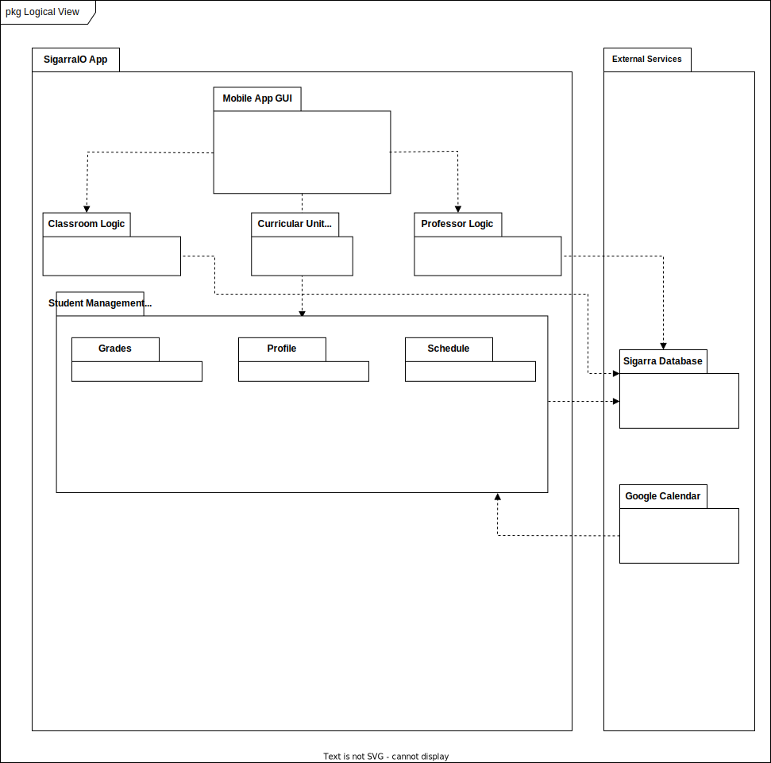

## Logical Architecture

## Physical Architecture 

## Vertical Prototype

To verify all our various decisions so far, we created a small prototype of the login app page, using the flutter framework and dart language. Our current implementation is simply visual
so that we could test its logic and functionality. 

