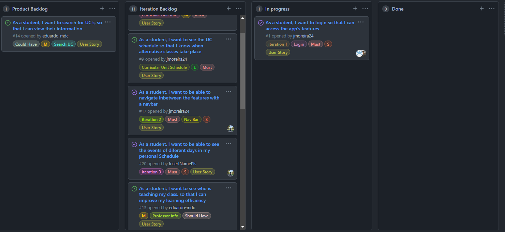
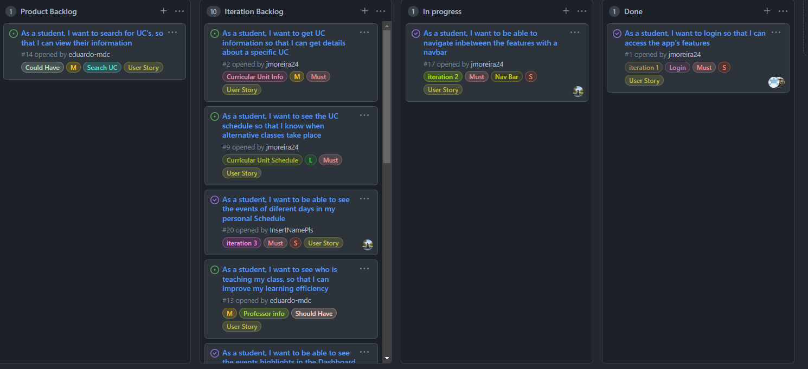
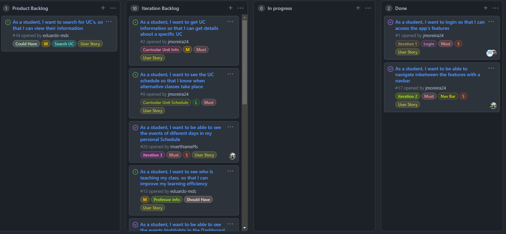
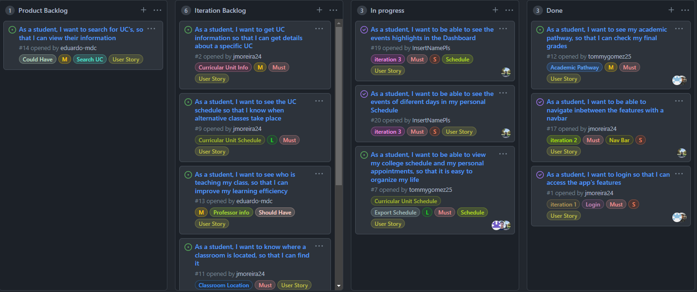
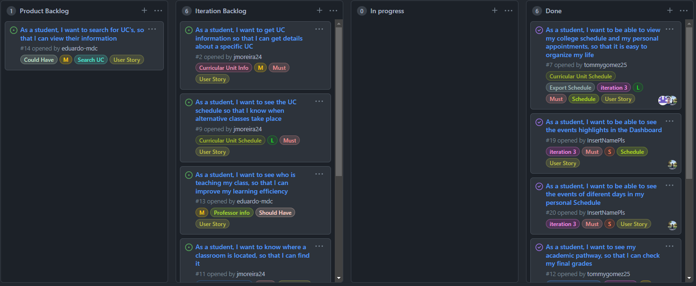

## Iteration Retrospectives

### Iteration 0 ([v0.0](https://github.com/LEIC-ES-2021-22/2LEIC15T1/releases/tag/v0.0)):

* Iteration planning and retrospectives: 
  * Plans: login implementation;
  * Retrospectives:
    - What went well: good organization and time management
    - What didn't go so well: -
    - What have I learned: the basics of flutter, due to it being our first contact with it;
    - What still puzzles me: due to every iteration being very self-contained, we cleared most, if not all, of our questions.
    
#### Iteration Start   

#### Iteration End   

### Iteration 2 ([v1.0](https://github.com/LEIC-ES-2021-22/2LEIC15T1/releases/tag/v1.0)):

* Iteration planning and retrospectives: 
  * Plans: creating a functioning sidebar and dummy pages for each feature, with one completed feature. Updating login security;
  * Retrospectives: 
    - What went well: we managed to deliver all the required things on time, even if a bit unpolished;
    - What didn't go so well: due to lack of time and poor team organization, there was no time to develop any of the dummy pages, which had to be delayed to the following iteration; We will deal with this issue by using the board more often so that our priorities are clear and the team stays focused.
    - What have I learned: the necessity of planning ahead and having regular team meetings to keep the work flow going;
    - What still puzzles me: -

#### Iteration Start   

#### Iteration End   

### Iteration 3 ([v2.0](https://github.com/LEIC-ES-2021-22/2LEIC15T1/releases/tag/v2.0)):

* Iteration planning and retrospectives: 
  * Plans: creating a functioning sidebar and dummy pages for each feature, with one completed feature. Updating login security;
  * Retrospectives: 
    - What went well: we managed to deliver all the required things on time, even if a bit unpolished;
    - What didn't go so well: due to lack of time, we didn't get to finish all the features we initially set out to do. Json to Datagrid, being one of the most lengthy parts of the process, was also troublesome as something that we weren't familiar with, taking more time to get right than we wanted.
    - What have I learned: how to implement datagrids in flutter and how to work with JSON for flutter.
    - What still puzzles me: -

#### Iteration Start   

#### Iteration End   

    
