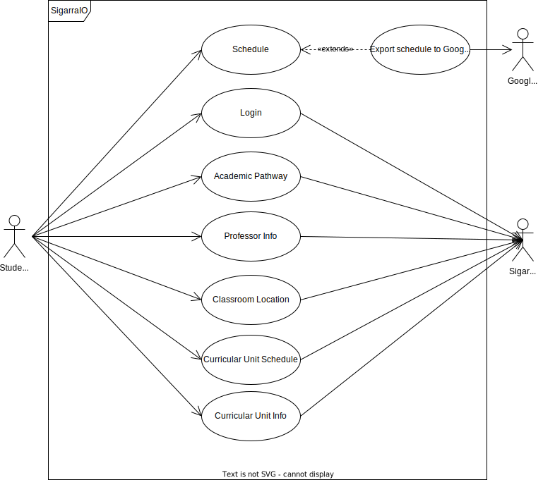

# Requirements

## Use Case Model

## Classroom Location
|||
| --- | --- |
| *Name* | Get Classroom Location |
| *Actor* |  Student | 
| *Description* | The student gets the location for a specific classroom with indication on how to get to the classroom in question |
| *Preconditions* | - The student must be logged in.   The Student must have selected a specific curricular unit either by their personal information page or Personal schedule page. Alternatively The student's schedule can also be used to query the classroom in question|
| *Postconditions* | - The student gets a map detailing the location and trajectory to the classroom.  |
| *Normal flow* | 1. The students logs in to the app (if not already logged in)   2. The application shows the student's schedule   3. The student selects a specific curricular unit through the schedule  4. The student clicks on the classroom they want to know the location of.   5. The application shows the location and trajectory to the classroom. |
| *Alternative flows and exceptions* | 1. [Schedule Flow] In step 3 the student instead can simply click on a specific classroom, skipping step 4.   2. [Personal Academic Pathway Flow] The student on step 2 can instead choose a specific curricular unit through their personal academic pathway. |

## Curricular Unit Schedule

|||
| --- | --- |
| *Name* | Get Curricular Unit Schedule |
| *Actor* |  Student | 
| *Description* | The user gets all the information about curricular unit Schedule|
| *Preconditions* | The student is logged in and has a personal schedule with curricular unit in their schedule |
| *Postconditions* | - The student gets the unit schedule |
| *Normal flow* | 1. The student opens the app  2.  Selects personal schedule   3. Selects the curricular unit   4. The student selects the option to see the unit schedule.
| *Alternative flows and exceptions* | 1. If the student selects the option with the personal information then the app follows the same flow as before. Instead of selecting from their personal schedule the student can select from the list of curricular units they’re enrolled for. |

## Curricular Unit Info

|||
| --- | --- |
| *Name* | Get Curricular Unit Info |
| *Actor* |  Student | 
| *Description* | The student gets all the information of the curricular unit. |
| *Preconditions* | - The student has to be logged in and on their personal info page.|
| *Postconditions* | - The student goes to the page with all of the curricular unit’s information. |
| *Normal flow* | 1. The student opens the app.  2. Selects personal schedule.  3. Selects the preferred curricular unit. |
| *Alternative flows and exceptions* | 1. The student can select personal info instead of personal schedule in step 2. |

## Personal Info

|||
| --- | --- |
| *Name* | Personal Schedule|
| *Actor* |  Student | 
| *Description* | The student gets their schedule with all the respective information|
| *Preconditions* | - The student is logged in   - The students has a personal schedule given by the university|
| *Postconditions* | - The student gets to visualize their schedule|
| *Normal flow* | 1. The student opens the app 2. Goes through the main menu and selects the schedule option. |
| *Alternative flows and exceptions* | 1. [No schedule available] if the student does not have an assigned schedule. |

## Schedule Export

|||
| --- | --- |
| *Name* | Schedule Export|
| *Actor* |  Student | 
| *Description* | The student gets a file containing their schedule with all the respective information that can be use by third person apps|
| *Preconditions* | - The student is logged in   - The students has a personal schedule given by the university|
| *Postconditions* | - The student gets a file corresponding to their schedule|
| *Normal flow* | 1. The student opens the app 2. Goes through the main menu and selects the schedule option.   3.The students selects the option to extract the schedule to a file.|
| *Alternative flows and exceptions* | 1. [No schedule available] if the student does not have an assigned schedule. |

## Login

|||
| --- | --- |
| *Name* | Login |
| *Actor* | Student | 
| *Description* | The student logs in. |
| *Preconditions* | - The student has to start the app. |
| *Postconditions* | - The student is logged in. |
| *Normal flow* | 1. The student starts the app.  2. Logs in. |
| *Alternative flows and exceptions* | 1. [Incorrect combination of user-password information] If, in step 2 of the normal flow the inserted user-password combination is incorrect, the system gives the student the possibility to cancel or retry.

|||
| --- | --- |
| *Name* | Get Professor Info |
| *Actor* |  Student | 
| *Description* | The student gets the professor information.|
| *Preconditions* | - The student must be logged in.   - The student must have selcted a specific curricular unit info. |
| *Postconditions* | - The student gets all the information about the professor.|
| *Normal flow* | 1. The student logs in to the app(if not already logged in).  2. The application shows the personal info and the schedule.  3. The student selects the curricular unit info through the personal info.  4. The application shows the professor info. |
| *Alternative flows and exceptions* |1.[Schedule flow] If wanted, the student can choose the curricular unit info through the schedule .|

## Get Academic Pathway

|||
| --- | --- |
| *Name* | Get Academic Pathway |
| *Actor* |  Student | 
| *Description* | The student is able to check all the curricular units in which he/she has already enrolled and obtain information about the grades obtained in each curricular unit, as well as the credits that each UC is worth  |
| *Preconditions* | - The student is registered in some UCs   - The student must be logged in. |
| *Postconditions* | - The student sees every UC grades and credits. |
| *Normal flow* | 1. The student logs in to the app(if not already logged in)  2. The application shows the personal info and the schedule.  3. The user can get detailed information about is pathway clicking in the personal info. |
| *Alternative flows and exceptions* | 1. [No UCs failure] If, in step 3 of the normal flow the student is not registered in at least 1 UC then that field is blank. |
