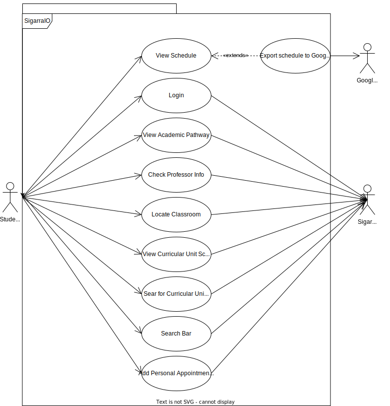

# Requirements

## Use Case Model

### Login

|||
| --- | --- |
| *Name* | Login |
| *Actor* | Student | 
| *Description* | The student logs in. |
| *Preconditions* | - The app is running. |
| *Postconditions* | - The student is logged in. |
| *Normal flow* | 1. The student starts the app.   2. The Student Logs in with their username and password. |
| *Alternative flows and exceptions* | 1. [Incorrect combination of user-password] If, in step 2 of the normal flow the inserted user-password combination is incorrect, the system gives the student the possibility to cancel or retry.

### Academic Pathway

|||
| --- | --- |
| *Name* | Academic Pathway |
| *Actor* |  Student | 
| *Description* | The student is able to check all the curricular units in which they have previously enrolled in and obtain information about the grades obtained in each curricular unit, as well as the credits that each UC is worth.  |
| *Preconditions* | - The student is registered in at least one UC.   - The student is logged in. |
| *Postconditions* | - The student sees every UC's grades and credits. |
| *Normal flow* | 1. The student logs in to the app(if not already logged in)  2. The application shows the personal info and the schedule.  3. The user clicks in personal info section and gets detailed information about their academic pathway. |
| *Alternative flows and exceptions* | 1. [No UCs failure] If, in step 3 of the normal flow the student is not registered in at least 1 UC then that field is blank. |

### Professor Info

|||
| --- | --- |
| *Name* | Professor Info |
| *Actor* |  Student | 
| *Description* | The student gets the professor information.|
| *Preconditions* | - The student is logged in.   - The student selected a specific curricular unit. |
| *Postconditions* | - The student gets all the information about the professor.|
| *Normal flow* | 1. The student logs in to the app(if not already logged in).  2. The application shows the personal info and the schedule.  3. The student selects the curricular unit info through the personal info. 4. The Student selects the professor they want to check the information of. 5. The application shows the queried professor info. |
| *Alternative flows and exceptions* |1. [Schedule flow] If wanted, the student can open the curricular unit info page through their schedule. |

### Classroom Location
|||
| --- | --- |
| *Name* | Classroom Location |
| *Actor* |  Student | 
| *Description* | The student gets the location for a specific classroom with indication on how to get to the classroom in question. |
| *Preconditions* | - The student is logged in.   The Student selects a specific curricular unit either by their personal information page or Personal schedule page. Alternatively the student's schedule can also be used to query the classroom in question. |
| *Postconditions* | - The student gets a map detailing the location and trajectory to the classroom.  |
| *Normal flow* | 1. The students logs in to the app (if not already logged in)   2. The application shows the student's schedule   3. The student selects a specific curricular unit through the schedule  4. The student clicks on the classroom they want to know the location of.   5. The application shows the location and trajectory to the classroom. |
| *Alternative flows and exceptions* | 1. [Schedule Flow] In step 3 the student instead can simply click on a specific classroom, skipping step 4.   2. [Personal Academic Pathway Flow] The student on step 2 can instead choose a specific curricular unit through their personal academic pathway. |

### Curricular Unit Schedule

|||
| --- | --- |
| *Name* | Curricular Unit Schedule |
| *Actor* |  Student | 
| *Description* | The student gets all the information about curricular unit's schedule. |
| *Preconditions* | - The student is logged in.   - The student has a personal schedule in the current semester (the student is enrolled in at least one UC). |
| *Postconditions* | - The student gets their wanted UC's schedule. |
| *Normal flow* | 1. The student opens the app.  2.  Selects personal schedule.   3. Selects the curricular unit.   4. The student selects the option to see the unit's schedule.
| *Alternative flows and exceptions* | 1. [Personal Info Flow] The student can select personal info instead of personal schedule in step 2. |

### Curricular Unit Info

|||
| --- | --- |
| *Name* | Get Curricular Unit Info |
| *Actor* |  Student | 
| *Description* | The student gets all the information of the desired curricular unit. |
| *Preconditions* | - The student is logged in. |
| *Postconditions* | - The student goes to the page with all of the curricular unit’s information. |
| *Normal flow* | 1. The student opens the app.  2. Selects personal schedule.  3. Selects the preferred curricular unit. |
| *Alternative flows and exceptions* | 1. [Personal Info Flow] The student can select personal info instead of personal schedule in step 2. |

### Schedule

|||
| --- | --- |
| *Name* | Schedule |
| *Actor* |  Student | 
| *Description* | The student gets their schedule for the current semester. |
| *Preconditions* | - The student is logged in.   - The student is enrolled in at least one UC in the current semester.|
| *Postconditions* | - The student gets their schedule.|
| *Normal flow* | 1. The student opens the app 2. The schedule is presented in the home page. |
| *Alternative flows and exceptions* | 1. [No schedule available] if the student does not have an assigned schedule.   2. [Detailed schedule] The student can click on the schedule on step 2 for a more detailed view.|

### Schedule Export

|||
| --- | --- |
| *Name* | Schedule Export |
| *Actor* |  Google Calendar API | 
| *Description* | Exports the student's schedule to a third-party calendar file, usable by google calendar. |
| *Preconditions* | - The student is logged in.   - The student is enrolled in at least one UC in the current semester. |
| *Postconditions* | - The student gets a calendar file to use in third party applications. |
| *Normal flow* | 1. The student opens the app 2. Goes through the main menu and selects the detailed schedule option.   3. The student selects the option to export the schedule to a calendar file.|
| *Alternative flows and exceptions* | 1. [No schedule available] if the student does not have an assigned schedule. |

### Search Bar

|||
| --- | --- |
| *Name* | Search Bar |
| *Actor* |  Student | 
| *Description* | Searches the UC list with given code or name |
| *Preconditions* | - The student is logged in. |
| *Postconditions* | - The students gets results based on their search query. |
| *Normal flow* | 1. The student opens the app 2. Goes through the main menu and selects the search option   3. The student writes the query   4. The student gets a result based on their query. |
| *Alternative flows and exceptions* | 1. [No search results] if the student enters an invalid query |

### External Appointments

|||
| --- | --- |
| *Name* | Add Personal Appointments to Schedule |
| *Actor* |  Student | 
| *Description* | Adds non course related appointments to personal schedule |
| *Preconditions* | - The student is logged in. |
| *Postconditions* | - The students adds appointments to their app schedule |
| *Normal flow* | 1. The student opens the app 2. Goes through the main menu and selects the personal schedule menu   3. The student clicks on the add appointment button   4. The student gets a pop up on which they can enter a third party calendar link to add appointments to their personal schedule. |
| *Alternative flows and exceptions* | 1. [Invalid Link] if the student enters an invalid calendar link. |

## Domain Model

### Class Description